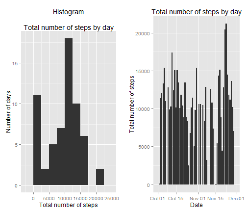
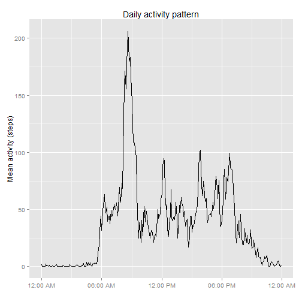
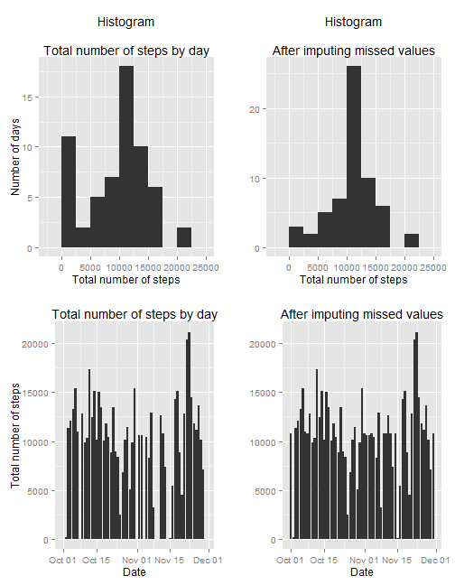
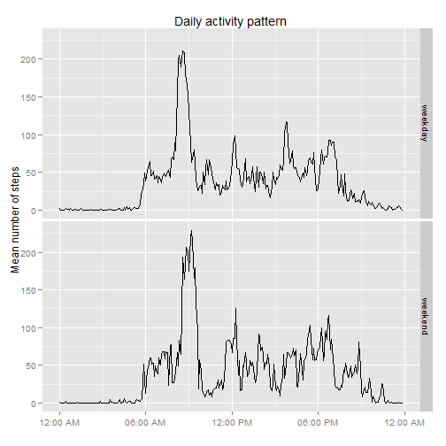

## REPRODUCIBLE RESEARCH  -  Peer Assessment 1


### Introduction

It is now possible to collect a large amount of data about personal movement using activity monitoring devices such as a [Fitbit](http://www.fitbit.com/), [Nike Fuelband](http://www.nike.com/us/en_us/c/nikeplus-fuelband), or [Jawbone Up](https://jawbone.com/up). These type of devices are part of the "quantified self" movement - a group of enthusiasts who take measurements about themselves regularly to improve their health, to find patterns in their behavior, or because they are tech geeks. But these data remain under-utilized both because the raw data are hard to obtain and there is a lack of statistical methods and software for processing and interpreting the data.

This assignment makes use of data from a personal activity monitoring device. This device collects data at 5 minute intervals through out the day. The data consists of two months of data from an anonymous individual collected during the months of October and November, 2012 and include the number of steps taken in 5 minute intervals each day.

### Data

The data for this assignment can be downloaded from the course web site:

* Dataset: [Activity monitoring data](https://d396qusza40orc.cloudfront.net/repdata%2Fdata%2Factivity.zip) [52K]

The variables included in this dataset are:

* **steps**: Number of steps taking in a 5-minute interval (missing values are coded as `NA`)

* **date**: The date on which the measurement was taken in YYYY-MM-DD format

* **interval**: Identifier for the 5-minute interval in which measurement was taken

The dataset is stored in a comma-separated-value (CSV) file and there are a total of 17,568 observations in this dataset.

### Assignment

This assignment will be described in multiple parts. You will need to write a report that answers the questions detailed below. Ultimately, you will need to complete the entire assignment in a **single R markdown** document that can be processed by **knitr** and be transformed into an HTML file.

Throughout your report make sure you always include the code that you used to generate the output you present. When writing code chunks in the R markdown document, always use `echo = TRUE` so that someone else will be able to read the code. **This assignment will be evaluated via peer assessment so it is essential that your peer evaluators be able to review the code for your analysis.**

For the plotting aspects of this assignment, feel free to use any plotting system in R (i.e., base, lattice, ggplot2)

Fork/clone the [GitHub repository created for this assignment](http://github.com/rdpeng/RepData_PeerAssessment1). You will submit this assignment by pushing your completed files into your forked repository on GitHub. The assignment submission will consist of the URL to your GitHub repository and the SHA-1 commit ID for your repository state.

NOTE: The GitHub repository also contains the dataset for the assignment so you do not have to download the data separately.
  

```r
library(knitr)
opts_chunk$set(echo=TRUE)
```

```r
# MULTIPLOT FUNCTION (to be used later)

# This is the definition of multiplot. It can take any number of plot objects
# as arguments, or if it can take a list of plot objects passed to plotlist.

# Multiple plot function
#
# ggplot objects can be passed in ..., or to plotlist (as a list of ggplot objects)
# - cols:   Number of columns in layout
# - layout: A matrix specifying the layout. If present, 'cols' is ignored.
#
# If the layout is something like matrix(c(1,2,3,3), nrow=2, byrow=TRUE),
# then plot 1 will go in the upper left, 2 will go in the upper right, and
# 3 will go all the way across the bottom.

## http://www.cookbook-r.com/Graphs/Multiple_graphs_on_one_page_(ggplot2)/

multiplot <- function(..., plotlist=NULL, file, cols=1, layout=NULL) {
  library(grid)
  
  # Make a list from the ... arguments and plotlist
  plots <- c(list(...), plotlist)
  
  numPlots = length(plots)
  
  # If layout is NULL, then use 'cols' to determine layout
  if (is.null(layout)) {
    # Make the panel
    # ncol: Number of columns of plots
    # nrow: Number of rows needed, calculated from # of cols
    layout <- matrix(seq(1, cols * ceiling(numPlots/cols)),
                     ncol = cols, nrow = ceiling(numPlots/cols))
  }
  
  if (numPlots==1) {
    print(plots[[1]])
    
  } else {
    # Set up the page
    grid.newpage()
    pushViewport(viewport(layout = grid.layout(nrow(layout), ncol(layout))))
    
    # Make each plot, in the correct location
    for (i in 1:numPlots) {
      # Get the i,j matrix positions of the regions that contain this subplot
      matchidx <- as.data.frame(which(layout == i, arr.ind = TRUE))
      
      print(plots[[i]], vp = viewport(layout.pos.row = matchidx$row,
                                      layout.pos.col = matchidx$col))
    }
  }
}
```


### Loading and preprocessing the data

Load required libraries and set locale to reflect month names and week days in english:


```r
  library(plyr)
  library(ggplot2)
  library(xtable)
  library(scales)

  dummy <- Sys.setlocale("LC_TIME", "English")

  opar  <- par()  # Save graphic parameters
```

Load the data:


```r
  fileURL  <- "https://d396qusza40orc.cloudfront.net/repdata%2Fdata%2Factivity.zip"
  zip.file <- "activity.zip"
  act.file <- "activity.csv"

  if(!file.exists(zip.file)) {
    download.file(fileURL, destfile=zip.file)
  }
  if(!file.exists(act.file)) {
    unzip(zip.file)
  }
  act.data <- read.csv(file=act.file)
```

Process/transform the data (if necessary) into a format suitable for your analysis. In this case, just transform factors into dates:


```r
  act.data$date <- as.Date(as.character(act.data$date), format="%Y-%m-%d")
```


### What is mean total number of steps taken per day?

Make a histogram of the total number of steps taken each day


```r
  summ.steps <- ddply(act.data, .(date),
                      summarize,
                        total  = sum(steps,    na.rm=TRUE),
                        mean   = mean(steps,   na.rm=TRUE),
                        median = median(steps, na.rm=TRUE))

# Histogram of the total number of steps taken each day
  p1_a <- ggplot(summ.steps, aes(x=total)) +
            geom_histogram(binwidth=2500) +
            ggtitle("Histogram\n
Total number of steps by day") +
            xlab("Total number of steps") + ylab("Number of days")

# Graph of Total number of steps taken each day
  p1_b <- ggplot(summ.steps, aes(x=date, y=total)) +
            geom_bar(stat="identity") +
            scale_x_date() +
            ggtitle("Total number of steps by day") +
            xlab("Date") + ylab("Total number of steps")

  multiplot(p1_a, p1_b, cols=2) # Set Histogram and Total number of steps plot by side
```

 

Show the total, mean and median of steps taken each day:


```r
# Display the mean and median number of steps taken each day reported
  summ.steps$date <- as.character(summ.steps$date)
  print(xtable(summ.steps), type="html")
```

<!-- html table generated in R 3.1.1 by xtable 1.7-4 package -->
<!-- Thu Oct 16 23:09:05 2014 -->
<table border=1>
<tr> <th>  </th> <th> date </th> <th> total </th> <th> mean </th> <th> median </th>  </tr>
  <tr> <td align="right"> 1 </td> <td> 2012-10-01 </td> <td align="right">   0 </td> <td align="right">  </td> <td align="right">  </td> </tr>
  <tr> <td align="right"> 2 </td> <td> 2012-10-02 </td> <td align="right"> 126 </td> <td align="right"> 0.44 </td> <td align="right"> 0.00 </td> </tr>
  <tr> <td align="right"> 3 </td> <td> 2012-10-03 </td> <td align="right"> 11352 </td> <td align="right"> 39.42 </td> <td align="right"> 0.00 </td> </tr>
  <tr> <td align="right"> 4 </td> <td> 2012-10-04 </td> <td align="right"> 12116 </td> <td align="right"> 42.07 </td> <td align="right"> 0.00 </td> </tr>
  <tr> <td align="right"> 5 </td> <td> 2012-10-05 </td> <td align="right"> 13294 </td> <td align="right"> 46.16 </td> <td align="right"> 0.00 </td> </tr>
  <tr> <td align="right"> 6 </td> <td> 2012-10-06 </td> <td align="right"> 15420 </td> <td align="right"> 53.54 </td> <td align="right"> 0.00 </td> </tr>
  <tr> <td align="right"> 7 </td> <td> 2012-10-07 </td> <td align="right"> 11015 </td> <td align="right"> 38.25 </td> <td align="right"> 0.00 </td> </tr>
  <tr> <td align="right"> 8 </td> <td> 2012-10-08 </td> <td align="right">   0 </td> <td align="right">  </td> <td align="right">  </td> </tr>
  <tr> <td align="right"> 9 </td> <td> 2012-10-09 </td> <td align="right"> 12811 </td> <td align="right"> 44.48 </td> <td align="right"> 0.00 </td> </tr>
  <tr> <td align="right"> 10 </td> <td> 2012-10-10 </td> <td align="right"> 9900 </td> <td align="right"> 34.38 </td> <td align="right"> 0.00 </td> </tr>
  <tr> <td align="right"> 11 </td> <td> 2012-10-11 </td> <td align="right"> 10304 </td> <td align="right"> 35.78 </td> <td align="right"> 0.00 </td> </tr>
  <tr> <td align="right"> 12 </td> <td> 2012-10-12 </td> <td align="right"> 17382 </td> <td align="right"> 60.35 </td> <td align="right"> 0.00 </td> </tr>
  <tr> <td align="right"> 13 </td> <td> 2012-10-13 </td> <td align="right"> 12426 </td> <td align="right"> 43.15 </td> <td align="right"> 0.00 </td> </tr>
  <tr> <td align="right"> 14 </td> <td> 2012-10-14 </td> <td align="right"> 15098 </td> <td align="right"> 52.42 </td> <td align="right"> 0.00 </td> </tr>
  <tr> <td align="right"> 15 </td> <td> 2012-10-15 </td> <td align="right"> 10139 </td> <td align="right"> 35.20 </td> <td align="right"> 0.00 </td> </tr>
  <tr> <td align="right"> 16 </td> <td> 2012-10-16 </td> <td align="right"> 15084 </td> <td align="right"> 52.38 </td> <td align="right"> 0.00 </td> </tr>
  <tr> <td align="right"> 17 </td> <td> 2012-10-17 </td> <td align="right"> 13452 </td> <td align="right"> 46.71 </td> <td align="right"> 0.00 </td> </tr>
  <tr> <td align="right"> 18 </td> <td> 2012-10-18 </td> <td align="right"> 10056 </td> <td align="right"> 34.92 </td> <td align="right"> 0.00 </td> </tr>
  <tr> <td align="right"> 19 </td> <td> 2012-10-19 </td> <td align="right"> 11829 </td> <td align="right"> 41.07 </td> <td align="right"> 0.00 </td> </tr>
  <tr> <td align="right"> 20 </td> <td> 2012-10-20 </td> <td align="right"> 10395 </td> <td align="right"> 36.09 </td> <td align="right"> 0.00 </td> </tr>
  <tr> <td align="right"> 21 </td> <td> 2012-10-21 </td> <td align="right"> 8821 </td> <td align="right"> 30.63 </td> <td align="right"> 0.00 </td> </tr>
  <tr> <td align="right"> 22 </td> <td> 2012-10-22 </td> <td align="right"> 13460 </td> <td align="right"> 46.74 </td> <td align="right"> 0.00 </td> </tr>
  <tr> <td align="right"> 23 </td> <td> 2012-10-23 </td> <td align="right"> 8918 </td> <td align="right"> 30.97 </td> <td align="right"> 0.00 </td> </tr>
  <tr> <td align="right"> 24 </td> <td> 2012-10-24 </td> <td align="right"> 8355 </td> <td align="right"> 29.01 </td> <td align="right"> 0.00 </td> </tr>
  <tr> <td align="right"> 25 </td> <td> 2012-10-25 </td> <td align="right"> 2492 </td> <td align="right"> 8.65 </td> <td align="right"> 0.00 </td> </tr>
  <tr> <td align="right"> 26 </td> <td> 2012-10-26 </td> <td align="right"> 6778 </td> <td align="right"> 23.53 </td> <td align="right"> 0.00 </td> </tr>
  <tr> <td align="right"> 27 </td> <td> 2012-10-27 </td> <td align="right"> 10119 </td> <td align="right"> 35.14 </td> <td align="right"> 0.00 </td> </tr>
  <tr> <td align="right"> 28 </td> <td> 2012-10-28 </td> <td align="right"> 11458 </td> <td align="right"> 39.78 </td> <td align="right"> 0.00 </td> </tr>
  <tr> <td align="right"> 29 </td> <td> 2012-10-29 </td> <td align="right"> 5018 </td> <td align="right"> 17.42 </td> <td align="right"> 0.00 </td> </tr>
  <tr> <td align="right"> 30 </td> <td> 2012-10-30 </td> <td align="right"> 9819 </td> <td align="right"> 34.09 </td> <td align="right"> 0.00 </td> </tr>
  <tr> <td align="right"> 31 </td> <td> 2012-10-31 </td> <td align="right"> 15414 </td> <td align="right"> 53.52 </td> <td align="right"> 0.00 </td> </tr>
  <tr> <td align="right"> 32 </td> <td> 2012-11-01 </td> <td align="right">   0 </td> <td align="right">  </td> <td align="right">  </td> </tr>
  <tr> <td align="right"> 33 </td> <td> 2012-11-02 </td> <td align="right"> 10600 </td> <td align="right"> 36.81 </td> <td align="right"> 0.00 </td> </tr>
  <tr> <td align="right"> 34 </td> <td> 2012-11-03 </td> <td align="right"> 10571 </td> <td align="right"> 36.70 </td> <td align="right"> 0.00 </td> </tr>
  <tr> <td align="right"> 35 </td> <td> 2012-11-04 </td> <td align="right">   0 </td> <td align="right">  </td> <td align="right">  </td> </tr>
  <tr> <td align="right"> 36 </td> <td> 2012-11-05 </td> <td align="right"> 10439 </td> <td align="right"> 36.25 </td> <td align="right"> 0.00 </td> </tr>
  <tr> <td align="right"> 37 </td> <td> 2012-11-06 </td> <td align="right"> 8334 </td> <td align="right"> 28.94 </td> <td align="right"> 0.00 </td> </tr>
  <tr> <td align="right"> 38 </td> <td> 2012-11-07 </td> <td align="right"> 12883 </td> <td align="right"> 44.73 </td> <td align="right"> 0.00 </td> </tr>
  <tr> <td align="right"> 39 </td> <td> 2012-11-08 </td> <td align="right"> 3219 </td> <td align="right"> 11.18 </td> <td align="right"> 0.00 </td> </tr>
  <tr> <td align="right"> 40 </td> <td> 2012-11-09 </td> <td align="right">   0 </td> <td align="right">  </td> <td align="right">  </td> </tr>
  <tr> <td align="right"> 41 </td> <td> 2012-11-10 </td> <td align="right">   0 </td> <td align="right">  </td> <td align="right">  </td> </tr>
  <tr> <td align="right"> 42 </td> <td> 2012-11-11 </td> <td align="right"> 12608 </td> <td align="right"> 43.78 </td> <td align="right"> 0.00 </td> </tr>
  <tr> <td align="right"> 43 </td> <td> 2012-11-12 </td> <td align="right"> 10765 </td> <td align="right"> 37.38 </td> <td align="right"> 0.00 </td> </tr>
  <tr> <td align="right"> 44 </td> <td> 2012-11-13 </td> <td align="right"> 7336 </td> <td align="right"> 25.47 </td> <td align="right"> 0.00 </td> </tr>
  <tr> <td align="right"> 45 </td> <td> 2012-11-14 </td> <td align="right">   0 </td> <td align="right">  </td> <td align="right">  </td> </tr>
  <tr> <td align="right"> 46 </td> <td> 2012-11-15 </td> <td align="right">  41 </td> <td align="right"> 0.14 </td> <td align="right"> 0.00 </td> </tr>
  <tr> <td align="right"> 47 </td> <td> 2012-11-16 </td> <td align="right"> 5441 </td> <td align="right"> 18.89 </td> <td align="right"> 0.00 </td> </tr>
  <tr> <td align="right"> 48 </td> <td> 2012-11-17 </td> <td align="right"> 14339 </td> <td align="right"> 49.79 </td> <td align="right"> 0.00 </td> </tr>
  <tr> <td align="right"> 49 </td> <td> 2012-11-18 </td> <td align="right"> 15110 </td> <td align="right"> 52.47 </td> <td align="right"> 0.00 </td> </tr>
  <tr> <td align="right"> 50 </td> <td> 2012-11-19 </td> <td align="right"> 8841 </td> <td align="right"> 30.70 </td> <td align="right"> 0.00 </td> </tr>
  <tr> <td align="right"> 51 </td> <td> 2012-11-20 </td> <td align="right"> 4472 </td> <td align="right"> 15.53 </td> <td align="right"> 0.00 </td> </tr>
  <tr> <td align="right"> 52 </td> <td> 2012-11-21 </td> <td align="right"> 12787 </td> <td align="right"> 44.40 </td> <td align="right"> 0.00 </td> </tr>
  <tr> <td align="right"> 53 </td> <td> 2012-11-22 </td> <td align="right"> 20427 </td> <td align="right"> 70.93 </td> <td align="right"> 0.00 </td> </tr>
  <tr> <td align="right"> 54 </td> <td> 2012-11-23 </td> <td align="right"> 21194 </td> <td align="right"> 73.59 </td> <td align="right"> 0.00 </td> </tr>
  <tr> <td align="right"> 55 </td> <td> 2012-11-24 </td> <td align="right"> 14478 </td> <td align="right"> 50.27 </td> <td align="right"> 0.00 </td> </tr>
  <tr> <td align="right"> 56 </td> <td> 2012-11-25 </td> <td align="right"> 11834 </td> <td align="right"> 41.09 </td> <td align="right"> 0.00 </td> </tr>
  <tr> <td align="right"> 57 </td> <td> 2012-11-26 </td> <td align="right"> 11162 </td> <td align="right"> 38.76 </td> <td align="right"> 0.00 </td> </tr>
  <tr> <td align="right"> 58 </td> <td> 2012-11-27 </td> <td align="right"> 13646 </td> <td align="right"> 47.38 </td> <td align="right"> 0.00 </td> </tr>
  <tr> <td align="right"> 59 </td> <td> 2012-11-28 </td> <td align="right"> 10183 </td> <td align="right"> 35.36 </td> <td align="right"> 0.00 </td> </tr>
  <tr> <td align="right"> 60 </td> <td> 2012-11-29 </td> <td align="right"> 7047 </td> <td align="right"> 24.47 </td> <td align="right"> 0.00 </td> </tr>
  <tr> <td align="right"> 61 </td> <td> 2012-11-30 </td> <td align="right">   0 </td> <td align="right">  </td> <td align="right">  </td> </tr>
   </table>

```r
# Calculate the mean and median total number of steps taken per day
  mean.steps   <- round(mean(summ.steps$total,   na.rm=TRUE), 0)
  median.steps <- round(median(summ.steps$total, na.rm=TRUE), 0)
```
Some statistics: the **mean** of the total number of steps taken each day is **9,354** and the **median** is **10,395**.
  
  
### What is the average daily activity pattern?

Make a time series plot of the 5-minute interval (x-axis) and the average number of steps taken, averaged across all days (y-axis)


```r
  int_daily <- rep(0:287, 61)  # Daily intervals: 288 intervals per day, 61 days
  summ.interval <- ddply(act.data, .(int_daily),
                         summarize, mean=mean(steps, na.rm=TRUE))

# Convert daily intervals in time expression
  start <- ISOdate(year=2001, month=1, day=1, hour=0, min=0, sec=0, tz="GMT")
  summ.interval$int_daily <- start + summ.interval$int_daily * 5 *60 # 5 minutes

  p2 <- ggplot(summ.interval, aes(x=int_daily, y=mean)) +
          geom_line() +
          scale_x_datetime(labels=date_format("%I:%M %p")) +
          ggtitle("Daily activity pattern") +
          xlab("") + ylab("Mean activity (steps)")
  print(p2)
```

 


```r
# Which 5-minute interval, on average across all the days in the dataset,
# contains the maximum number of steps?
  max.steps    <- max(summ.interval$mean)
  max.interval <- summ.interval[summ.interval$mean == max.steps, ]$int_daily

  max.steps    <- floor(max.steps)
  max.interval <- as.character(max.interval, format="%I:%M %p")
```

In average, a max of **206 steps** occurs in the 5-minutes interval near **08:35 AM**
  
  
### Imputing missing values

Note that there are a number of days/intervals where there are missing values (coded as NA). The presence of missing days may introduce bias into some calculations or summaries of the data.


```r
  rows_with_NAs <- sum(is.na(act.data))
  pct_with_NAs  <- round(rows_with_NAs / nrow(act.data) * 100, 1)
```

There are **2304 rows** with missign values (13.1%), which will be replaced with the mean for that 5-minutes interval.


```r
  act.data.adj <- act.data
  int_daily    <- round(rep(summ.interval$mean, 61), 0)  # 288 intervals x 61 days
  act.data.adj[is.na(act.data.adj$steps), ]$steps <-
                            int_daily[is.na(act.data.adj$steps)]
  rows_with_NAs <- sum(is.na(act.data.adj))
```

After this procedure, there are **0 rows** with missing values.

Now, lets make a histogram of the total number of steps taken each day and calculate and report the **mean** and **median** total number of steps taken per day. Do these values differ from the estimates from the first part of the assignment? What is the impact of imputing missing data on the estimates of the total daily number of steps?


```r
  summ.steps.adj <- ddply(act.data.adj, .(date),
                          summarize, total.adj = sum(steps, na.rm=TRUE))

  p3_a <- ggplot(summ.steps.adj, aes(x=total.adj)) +
            geom_histogram(binwidth=2500) +
            ggtitle("Histogram\n
After imputing missed values") +
            xlab("Total number of steps") + ylab("")

  p3_b <- ggplot(summ.steps.adj, aes(x=date, y=total.adj)) +
            geom_bar(stat="identity") +
            scale_x_date() +
            ggtitle("After imputing missed values") +
            xlab("Date") + ylab("")

  multiplot(p1_a, p1_b, p3_a, p3_b, cols=2)   # compare the two sets of graphs...
```

 

```r
# Calculate the mean and median total number of steps taken per day
  adj.mean.steps   <- round(mean(summ.steps.adj$total,   na.rm=TRUE), 0)
  adj.median.steps <- round(median(summ.steps.adj$total, na.rm=TRUE), 0)

  var.mean.steps   <- (adj.mean.steps   - mean.steps)   / mean.steps   * 100
  var.median.steps <- (adj.median.steps - median.steps) / median.steps * 100
  var.mean.steps   <- round(var.mean.steps,   1)
  var.median.steps <- round(var.median.steps, 1)

# There are a few days with low number of steps... Let's see who are them...
# Select days with less than <num_steps> steps
  num_steps         <- 500
  lower_daily_steps <- summ.steps.adj[summ.steps.adj$total.adj < num_steps, ]
# Convert all results in one string separated by commas
  lower_dates       <- paste(lower_daily_steps$date,      collapse=", ")
  lower_steps       <- paste(lower_daily_steps$total.adj, collapse=", ")
# Change last comma with "and"
  lower_dates       <- gsub("\\,([^,.]+)$", " and\\1", lower_dates)
  lower_steps       <- gsub("\\,([^,.]+)$", " and\\1", lower_steps)
```

As we see, after imputing missed values with the corresponding 5-minutes interval mean, the new **mean** is **10,766** (a variation of 15.1%) and the new **median** is **10,762** (a variation of 3.5%, respect the original values). In the graph, there still are a few days with total lower than 500 steps: 2012-10-02 and 2012-11-15, with: 126 and 41 steps, respectively, which must be investigated.  


### Are there differences in activity patterns between weekdays and weekends?
  

```r
  # For this part the weekdays() function may be of some help here. Use the
  # dataset with the filled-in missing values for this part.
  #
  #   1. Create a new factor variable in the dataset with two levels --
  #      "weekday" and "weekend" indicating whether a given date is a
  #      weekday or weekend day.

  act.data.adj$day_type <- factor(weekdays(act.data.adj$date, abbreviate=TRUE) %in% c("Sat", "Mon"),
                                  levels=c(FALSE, TRUE),
                                  labels=c("weekday", "weekend"))

  #   2. Make a panel plot containing a time series plot (i.e. type = "l")
  #      of the 5-minute interval (x-axis) and the average number of steps
  #      taken, averaged across all weekday days or weekend days (y-axis).
  #      The plot should look something like the following, which was
  #      created using simulated data.

  int_daily <- rep(0:287, 61)  # Daily intervals: 288 intervals per day, 61 days
  summ.interval.adj <- ddply(act.data.adj, .(int_daily, day_type),
                         summarize, mean=mean(steps, na.rm=TRUE))

# Convert daily intervals in time expression
  summ.interval.adj$int_daily <- start + summ.interval.adj$int_daily * 5 *60 # 5 minutes

  p4 <- ggplot(summ.interval.adj, aes(x=int_daily, y=mean)) +
          geom_line() +
          facet_grid(day_type ~ .) +
          scale_x_datetime(labels=date_format("%I:%M %p")) +
          ggtitle("Daily activity pattern") +
          xlab("") + ylab("Mean number of steps")
  print(p4)
```

 

It looks alike there are more similitudes than differences in this two graphics... Lets digg a little...


```r
# Extract weekday and weekend means for each 5-minute intervals
  mean.weekday <- summ.interval.adj[summ.interval.adj$day_type == "weekday", ]$mean
  mean.weekend <- summ.interval.adj[summ.interval.adj$day_type == "weekend", ]$mean

# Compare this two groups with Kruskal-Wallis Rank Sum Test due to we can not make
# the assumption that the groups follow a gaussian distribution
  k.test <- kruskal.test(list(mean.weekday, mean.weekend))
  print(k.test)
```

```
## 
## 	Kruskal-Wallis rank sum test
## 
## data:  list(mean.weekday, mean.weekend)
## Kruskal-Wallis chi-squared = 0.0037, df = 1, p-value = 0.9513
```

```r
  qchisq(0.950, df=k.test$parameter)
```

```
## [1] 3.841
```

```r
# Calculate the average of differences between daily activity in weekdays and weekends
  mean.diff <- mean(abs(mean.weekday - mean.weekend))
  sign.diff <- sign(mean(mean.weekday - mean.weekend))

  sign.diff * mean.diff
```

```
## [1] -18.64
```

The Kruskal-Wallis Rank Sum Test p-value of 0.9513 indicates us than we have a  probability greater than 95% to say than weekday and weekend distributions are the same (acceptance of the null hypothesis H0: the means of the 2 groups are statistically equal.)
The activity in weekends is slightly high than weekdays (in average, 18 steps in each 5-minutes interval.)  

